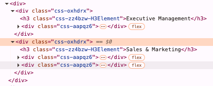
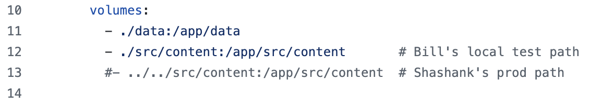

# rippling_jobs_oneorigin

Webscrape the rippling OneOrigin job postings and create a json object file to read job postings into oneorigin.us website.

## Features

* Read the rippling site for OneOrigin Job postings
* using Python and BeautifulSoup4 webscraping logic to collect the job information
* Create a json file that Shashank can use to update the oneorigin.us site with fresh job postings

## Setup

* **On your local, create a data directory in your project folder (or Docker Compose will create it for you):**
* **for example: (use the your own base directory with a subfolder 'data')**
* mkdir -p /Users/billkillacky/Dev/rip_jobs_webscrape/data
* **Run your container using Docker Compose: (from your base directory)**
* cd /Users/billkillacky/Dev/rip_jobs_webscrape
* docker-compose up 
* **To run it in the background:**
* docker-compose up -d
* **To rebuild if you make changes:**
* docker-compose up --build
* docker compose up
* **With this setup, the data written in your Python script to /app/data**
* **will appear in the data subdirectory of your project folder**
* **(/Users/billkillacky/Dev/rip_jobs_webscrape/data on your local machine).**
* ~
* **confirm the tag was used**
* docker images
* docker ps

## Original Installation

* Python 3.13.1
* pip install requests
* pip install beautifulsoup4
* **(but the requirements.txt has the python modules needed)**

## Logic to consider when things break - These values can be replaced in `rip_jobs.py` when rippling changes the html code.

* **Find all top-level sections (group of jobs)**
* sections = soup.select('`.css-oxhdrx`')  (see usage below)
* **Within each section find individual job information**
* ~~job_blocks = section.select('`.css-cq05mv`')~~
* job_blocks = section.select('`.css-aapqz6`') (see usage below)
* currently the OneOrigin mission statement is separated from the job description by `#LI-Onsite`. When this changes the results will vary.
* anticipated work_modes = ['`#LI-Onsite`', '`#LI-Remote`', '`#LI-Hybrid`']

## Usage

* Command Line Arguments are now used to pass the sections and job_blocks values.
* docker-compose.yml contains: 
* command: ["python", "rip_jobs.py", "--sections", "css-oxhdrx", "--job_blocks", "css-aapqz6"] 
* 
* When the webscraping fails due to new css values:
* update docker-compose.yml to change the command values for --sections or --job_blocks 
* 
* When bringing into production from github, 
* edit your local docker-compose.yml:
* comment out "Bill's local test path" line, and uncomment "Shashank's prod path" line

